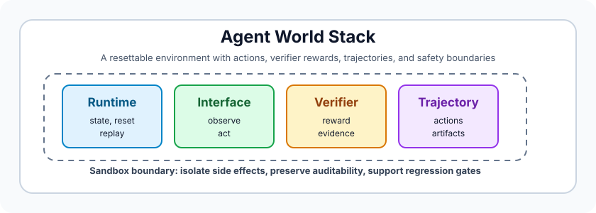
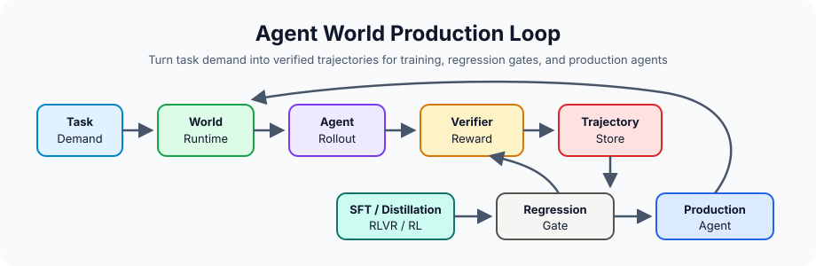

<h1 align="center">Awesome Agent Worlds</h1>

<p align="center">A curated evidence map for <b>resettable environments, verifiable rewards, trajectories, sandboxes, and post-training loops for LLM/VLM agents</b>.</p>

<p align="center"><a href="./site/index.html">Static Explorer</a> · <a href="./others/docs/resource-index.md">Resource Index</a> · <a href="./others/docs/hot-papers.md">Hot Papers</a> · <a href="./site/README.md">Explorer Guide</a> · <a href="#contributing">Contribute</a> · <a href="#citation">Cite</a></p>

## What are Agent Worlds?

An **Agent World** is an executable, resettable, and verifiable task environment for AI agents. It exposes observations and actions, evolves state through a runtime or simulator, scores outcomes through a verifier or reward contract, and can generate trajectories for evaluation, post-training, debugging, regression testing, and release gating.

```text
World = runtime + state/reset + observation/action + transition dynamics
      + verifier/reward + trajectory + sandbox/safety
```

<p align="center">
  
</p>

| Evidence tier | Included when |
|---|---|
| Executable Agent World | It has a runnable stateful environment, action loop, reset path, and verifier or reward. |
| Verifiable benchmark / dataset | It provides reproducible or human-validated scoring, trajectories, or replayable tasks. |
| World infrastructure / protocol | It supplies sandboxing, tool interfaces, runtimes, memory, orchestration, or communication. |
| Frontier product signal | It shows where production agent systems are moving, without assuming public reproducibility. |
| Generated / synthetic world factory | It expands environments, tasks, verifiers, trajectories, curricula, or generated worlds. |

**Non-goals.** This is not a general list of agent frameworks, prompt libraries, chatbots, or workflow wrappers. A resource is usually excluded if it has no executable environment, benchmark, verifier, trajectory, sandbox, protocol, or training-loop relevance.

## Why Agent Worlds Matter Now

> The limiting feedback channel for agents is not more chat transcripts alone. It is verifiable worlds that produce reusable trajectories.

Frontier labs are converging on the same bottleneck: production agents must act in browsers, desktops, phones, repositories, APIs, simulators, and generated worlds. Durable progress depends on three world capabilities: realism and scale, verifier reliability, and trajectories that can become training assets.

## From Environment to Reward

<p align="center">
  
</p>

```text
Task Demand -> World Runtime -> Agent Rollout -> Verifier / Reward
-> Trajectory Store -> SFT / distillation / RLVR -> Regression Gate -> Production Agent
```

Here, SFT means supervised fine-tuning, and RLVR means reinforcement learning with verifiable rewards.

The reusable asset is the verified trajectory, not just the final score.

## Catalog Snapshot

| Scope | Current coverage |
|---|---:|
| Snapshot date | 2026-06-21 |
| Curated resources | 515 |
| Canonical categories | 11 |
| Public runnable resources | 87 |
| Weekly Hot Papers strip | 12 |
| Resources with trajectory assets | 301 |
| Resources with public repositories | 243 |
| Average readiness score | 9.0 / 14 |

Readiness scores summarize world-readiness evidence; they are not claims about
scientific impact or model quality.

## How to Read This List

Start with a narrow route, then use the structured views for exhaustive
coverage and evidence fields.

| Reader goal | Start with |
|---|---|
| Build agent evaluations | OSWorld-Verified, BrowserGym, WebArena-Verified, AndroidWorld, AndroidDaily, MobileGym, MacArena, Workflow-GYM, WeaveBench, EntWorld, MyPCBench, LabOSBench, LivingScreen, DynamicGUIBench / DynamicUI, DragOn, ComAct / ComCADBench, MedCUA-Bench, Multi-Agent Computer Use, AgentHijack, OSGuard, TClone, PhoneHarness, Beyond GUI Paradigm / CLI-Advantage, HiViG, Alem, EvoArena, Agentic Automata Learning, Self-Driving Negotiator, Ego2Web, EgoBench, SMH-Bench, DeepInsight, Embodied-BenchClaw, FATE-VLA, PhAIL / Physical AI Leaderboard, MCPWorld, MCP-Persona, MedCTA, BioManus / MCP-Native Biomedical Agent, CompSkillBench / Compositional Skill Routing, Task2MCP / T2MRec, GeoNatureAgent Benchmark, EpiBench, TerraBench, LoHoSearch, DailyReport, LiteCoder-Terminal, TIER, GE-Sim 2.0, iMaC, SurgVista, WRBench / Persistent State Core, World Models in Words, tau-Rec, AgentBeats, StakeBench. |
| Audit agent safety | PhoneSafety / Safe, or Simply Incapable?, NRT-Bench, CAPED, MIRAGE, MyPhoneBench, SkillSafetyBench, AgentTrust, AgentWall, SafeMCP, MCP-SafetyBench, MCP Pitfall Lab, ASPI, WARD, WebDecept, Sleeper Attack, BraveGuard / Open-World CUA Guard, CUA-HandCrafted / Domain-Conditioned Safety, OSGuard, TEE-Backed Isolation for Self-Hosted Computer-Use Agents, Memory-Induced Tool-Drift / MEMDRIFT, AgentHijack, MalSkillBench, SkillHarm, SCR-Bench / Skill Composition Risk, Description-Code Inconsistency / DCIChecker, PACT / Argument-Level Provenance, AI Sandboxes, Hack-Verifiable Environments, BadWorld, FATE-VLA, VASO, ProvenanceGuard, Attested Tool-Server Admission, PhoneHarness, Data Leakage Risks in Tool-Using LLM Agents, Terminal Wrench, BenchJack, CHERRL, Context-Fractured Decomposition Attacks, StakeBench. |
| Debug agent failures | AgentForesight, AgentRx, Who&When, AgentStepper, AgentHijack, RoTS / GUI-RobustEval, Terminal Wrench, FATE, FATE-VLA, AgentLAB, BenchJack, AgentPressureBench, Human-Guided Harm Recovery / BackBench, Evidence-Supported Bounds for Interactive-Agent Evaluation. |
| Train from rollouts | AgentGym, AgentGym-RL, Agent-World: Scaling Real-World Environment Synthesis for Evolving General Agent Intelligence, EnvScaler, ScaleEnv, RACES / Verifiable Environment Composition, AgentScaler / Environment Scaling, RODS, EnvRL, From Trainee to Trainer / LLM-as-Environment-Engineer, AgentJet, LLM-as-Code Agentic Programming for Agent Harness, Claw-R1, EvoTrainer, Environment-Grounded Automated Prompt Optimization, AsyncWebRL, GAIS, Role-Agent, OpenSkill, CoEvoSkills, CoEvolve, ProPlay, ADWM, SENTINEL, SkillCAT, SkillSmith / Skill-Tool Co-Evolution, VASO, HyperSim, Sibling-Guided Credit Distillation, TRACE Rollout Budget Allocation, HarnessBridge, MobileForge, UI-Copilot, MolmoWeb, Weblica, RoTS / GUI-RobustEval, OpenWebRL, PANDO, OpenSearch-VL, Speculative Rollback Correction, ADMIRE / Adaptive Milestone Reward, ShoppingBench Trajectory Primitive, Game Code World Model Generation, LiteCoder-Terminal, TIER, SimWorld Studio, GE-Sim 2.0, iMaC, SurgVista, AliyunConsoleAgent, HomeFlow, CUA-Gym, PRO-CUA, ProCUA-SFT, PROVE / Synthesize and Reward, Teach-and-Repeat, PhoneHarness, MemGUI-Agent, STAMP / Memory-World, TOUCAN, MCP-Flow, CompSkillBench / Compositional Skill Routing, BioManus / MCP-Native Biomedical Agent, HyperTool, EurekAgent, AgentBuild / Rietveld Refinement, MDForge, GUI-GENESIS, RAGEN, VAGEN, rLLM, Agent Lightning. |
| Track production direction | OpenAI Computer-Using Agent, OpenAI Agents SDK Sandbox, Gemini 2.5 Computer Use, Claude Managed Agents, Multi-Agent Computer Use, TClone, VISUALSKILL, CLI-Anything, Tool Forge, Agent-First Tool API, HarnessAPI, Harness Engineering for Physical AI, AI Sandboxes, AgentJet, LLM-as-Code Agentic Programming for Agent Harness, Agent JIT Compilation, TEE-Backed Isolation for Self-Hosted Computer-Use Agents, Memory-Induced Tool-Drift / MEMDRIFT, Claw-R1, PhAIL / Physical AI Leaderboard, AgentBeats, SafeMCP, MCP Pitfall Lab, Task2MCP / T2MRec, CoEvoSkills, UI-Copilot, MolmoWeb, Attested Tool-Server Admission, MCP Runtime Fault Taxonomy, Description-Code Inconsistency / DCIChecker, PACT / Argument-Level Provenance, CompSkillBench / Compositional Skill Routing, BioManus / MCP-Native Biomedical Agent, TIER, GE-Sim 2.0, iMaC, SurgVista, HyperSim, DeltaMCP, Evoflux, MCP-Flow, GAIS, PhoneHarness, ProvenanceGuard, Agent-Diff, Firefly Verified Tool-Call Data, BraveGuard / Open-World CUA Guard. |
| Study foundations | WebShop, WebArena, OSWorld, SWE-bench, AppWorld, tau-bench, AgentGym, MineDojo, AI2-THOR, Agentic World Modeling, Agentic Environment Engineering Survey, Text World Models for LLM Agents, World Models in Words, WRBench / Persistent State Core, Agentic Automata Learning. |

Recent coverage focus:

| Direction | New or high-signal entries |
|---|---|
| Personalized and clinical tool worlds | MCP-Persona, MedCTA, CHI-Bench, PhysicianBench |
| Professional GUI and computer-use workflows | MacArena, Workflow-GYM, WeaveBench, EntWorld, MyPCBench, LabOSBench, LivingScreen, DynamicGUIBench / DynamicUI, AndroidDaily, Beyond GUI Paradigm / CLI-Advantage, UI-Copilot, DragOn, ComAct / ComCADBench, MedCUA-Bench, Multi-Agent Computer Use, AgentHijack, OSGuard, TClone, OpenComputer, HiViG, CUA-Gym, ClawGUI |
| Web, mobile, MCP, tool-agent, and sandbox safety | StakeBench, WebDecept, NRT-Bench, Sleeper Attack, CAPED, MIRAGE, ASPI, WARD, Trust No Tool / TRUST-Bench, SafeMCP, MCP Pitfall Lab, Attested Tool-Server Admission, AgentHijack, OSGuard, MalSkillBench, SkillHarm, SCR-Bench / Skill Composition Risk, Description-Code Inconsistency / DCIChecker, PACT / Argument-Level Provenance, AI Sandboxes, FATE-VLA, VASO, ProvenanceGuard, PhoneHarness, Context-Fractured Decomposition Attacks, CUA-HandCrafted / Domain-Conditioned Safety, Data Leakage Risks in Tool-Using LLM Agents |
| Benchmark hardening and reward-hacking audits | Terminal Wrench, BenchJack, Rubric Reward Hacking, Hack-Verifiable Environments, CHERRL, Evidence-Supported Bounds for Interactive-Agent Evaluation |
| Rollout and reward infrastructure | RODS, EnvRL, From Trainee to Trainer / LLM-as-Environment-Engineer, AgentJet, EvoTrainer, Environment-Grounded Automated Prompt Optimization, AsyncWebRL, GAIS, Role-Agent, OpenSkill, CoEvoSkills, CoEvolve, ProPlay, ADWM, SENTINEL, SkillCAT, SkillSmith / Skill-Tool Co-Evolution, VASO, HyperSim, Sibling-Guided Credit Distillation, TRACE Rollout Budget Allocation, MobileForge, UI-Copilot, MolmoWeb, Weblica, RoTS / GUI-RobustEval, OpenWebRL, PANDO, OpenSearch-VL, Speculative Rollback Correction, ADMIRE / Adaptive Milestone Reward, Policy and World Modeling Co-Training, StainFlow, ShoppingBench Trajectory Primitive, Game Code World Model Generation, LiteCoder-Terminal, TIER, AliyunConsoleAgent, PRO-CUA, ProCUA-SFT, PROVE / Synthesize and Reward, Teach-and-Repeat, ClawGUI, PhoneHarness, STAMP / Memory-World, HomeFlow, Agent-World: Scaling Real-World Environment Synthesis for Evolving General Agent Intelligence, EnvScaler, ScaleEnv, AgentScaler / Environment Scaling, RACES, EnvFactory, EvoEnv, iMaC, SurgVista, Firefly Verified Tool-Call Data |
| MCP and agent infrastructure | CLI-Anything, Tool Forge, ADK Arena, MCP-Flow, HyperTool, Evoflux, VISUALSKILL, AgentBeats, HarnessBridge, HarnessAPI, Agent-First Tool API, MCP Pitfall Lab, Task2MCP / T2MRec, MCP Runtime Fault Taxonomy, DeltaMCP, Description-Code Inconsistency / DCIChecker, PACT / Argument-Level Provenance, CompSkillBench / Compositional Skill Routing, BioManus / MCP-Native Biomedical Agent, Attested Tool-Server Admission, GAIS, MCP Proxy Access Control, VIPER-MCP |
| Research environments and environment engineering | Emergence World, Alem, EvoArena, Agentic Automata Learning, EgoBench, SMH-Bench, DeepInsight, Embodied-BenchClaw, Harness Engineering for Physical AI, FATE-VLA, HyperSim, LoHoSearch, DailyReport, TerraBench, EpiBench, GeoNatureAgent Benchmark, AgentBuild / Rietveld Refinement, MDForge, SimWorld Studio, GE-Sim 2.0, iMaC, SurgVista, WRBench / Persistent State Core, BadWorld, Cosmos 3, Kairos, Prisma-World, Gamma-World, EurekAgent, Self-Driving Negotiator, Agentic Environment Engineering Survey, Agentic World Modeling, Text World Models for LLM Agents, World Models in Words |
| Frontier signals to watch | LLM-as-Code Agentic Programming for Agent Harness, Agent JIT Compilation, Claw-R1, TEE-Backed Isolation for Self-Hosted Computer-Use Agents, Memory-Induced Tool-Drift / MEMDRIFT, PhAIL / Physical AI Leaderboard |

| Label | Meaning |
|---|---|
| **Production-grade** | Runnable, resettable, verifier-backed, and trajectory- or sandbox-ready enough for production-style evaluation. |
| **Training candidate** | Useful for rollouts or rewards, with some reset, sandbox, or trajectory limitations. |
| **Eval candidate** | Useful for evaluation, but not yet a strong training source. |
| **Product signal** | Closed or vendor-managed agent capability; important directionally, not public training evidence. |
| **Training infrastructure** | Rollout, reward, or RL infrastructure for improving agents from environment feedback. |
| **Infrastructure / Protocol / Safety Control / Model Release** | Supporting systems that shape world composition, governance, or agent-control evidence. |

## Static Explorer

The bilingual [Static Explorer](./site/index.html) is a dependency-free webpage for browsing the curated resource set, filtering by surface and evidence fields, switching between Chinese and English, and reading an indexed Hot Papers strip from the weekly view. It opens with a compact homepage, a world-surface map, a weekly Hot Papers strip, and a searchable resource explorer with category, readiness, trajectory, reset, source, and public-repository filters. Run it from the repository root with `ruby -run -e httpd site -p 8026`, then open `http://127.0.0.1:8026/index.html`.

## Structured Views
[Explorer Guide](./site/README.md) · [Resource Index](./others/docs/resource-index.md) · [Selection Guide](./others/docs/selection-guide.md) · [Reading Order](./others/docs/reading-order.md) · [Hot Papers](./others/docs/hot-papers.md) · [Flagship Matrix](./others/docs/flagship-matrix.md)

## Table of Contents

[Infrastructure](#agent-infrastructure-and-protocols) · [Computer/GUI](#computer-and-gui-worlds) · [Web](#web-worlds) · [Mobile](#mobile-worlds) · [Code/terminal](#code-terminal-and-software-worlds) · [Tool/API](#tool-and-api-worlds) · [Research](#research-and-knowledge-work-worlds) · [Embodied/generative](#embodied-and-generative-worlds) · [Training](#training-rewards-and-post-training-infrastructure)

The README and Static Explorer group the 11 canonical categories into broader reader-facing surfaces; the [Resource Index](./others/docs/resource-index.md) is authoritative for canonical category placement.

---

## Agent Infrastructure and Protocols

> Core protocols, memory layers, tool interfaces, and agent-system infrastructure that make worlds composable across products.

### 2026
- [ADR / ADR-Bench](https://arxiv.org/abs/2605.17380) — Eval Candidate · Partial trajectories
- [ADK Arena](https://arxiv.org/abs/2606.05548) — Eval Candidate · ADK evaluation arena
- 🌟 [AgentSkillOS](https://arxiv.org/abs/2603.02176) [[Code](https://github.com/ynulihao/AgentSkillOS)] — Infrastructure · Skill retrieval and orchestration
- [AgentTrust](https://arxiv.org/abs/2605.04785) — Safety Control · Runtime tool-call interception
- 🌟 [Agent-ValueBench](https://valuebyte-ai.github.io/Agent-ValueBench.github.io/) [[Code](https://github.com/ValueByte-AI/Agent-ValueBench)] — Training Candidate · Value-conflict agent benchmark
- 🌟 [AgentSearchBench](https://bingo-w.github.io/AgentSearchBench/) [[Code](https://github.com/Bingo-W/AgentSearchBench)] — Eval Candidate · Agent discovery and reranking
- [AgentSelect](https://arxiv.org/abs/2603.03761) — Eval Candidate · Query-to-agent recommendation
- [Agent-BOM](https://arxiv.org/abs/2605.06812) — Infrastructure · Security-auditable operation graph
- [AgentBeats](https://arxiv.org/abs/2606.13608) — Infrastructure · Agentified A2A/MCP assessment
- [Agentic Environment Engineering Survey](https://arxiv.org/abs/2606.12191) — Infrastructure · Environment engineering lifecycle
- [LLM-as-Code Agentic Programming for Agent Harness](https://arxiv.org/abs/2606.15874) — Infrastructure · Agent harness as executable control-flow programs
- [AI Sandboxes](https://arxiv.org/abs/2606.18532) — Safety Control · Sandbox assurance taxonomy
- [EvoArena](https://arxiv.org/abs/2606.13681) — Eval Candidate · Dynamic environment memory benchmark
- [HarnessBridge](https://arxiv.org/abs/2606.12882) — Infrastructure · Learnable agent harness controller
- [NRT-Bench](https://arxiv.org/abs/2606.20408) — Eval Candidate · Multi-turn safety-critical red-team benchmark
- 🌟 [AgentWall](https://arxiv.org/abs/2605.16265) [[Code](https://github.com/agentwall/Agentwall)] — Safety Control · Runtime firewall
- [AgentLAB](https://arxiv.org/abs/2602.16901) — Training Candidate · Long-horizon attack benchmark
- 🌟 [AgentForesight](https://zbox1005.github.io/agent-foresight/) [[Code](https://github.com/ZBox1005/AgentForesight)] — Production-grade · Online multi-agent failure audit
- 🌟 [AgentRx](https://arxiv.org/abs/2602.02475) [[Code](https://github.com/microsoft/AgentRx)] — Training Candidate · Public failure-trajectory diagnosis
- [AgenTRIM](https://arxiv.org/abs/2601.12449) — Safety Control · Tool risk mitigation
- [Behavioral Integrity Verification for AI Agent Skills](https://arxiv.org/abs/2605.11770) — Safety Control · Skill behavior audit
- [Context-Fractured Decomposition Attacks](https://arxiv.org/abs/2606.09084) — Safety Control · Artifact provenance gap
- [Data Leakage Risks in Tool-Using LLM Agents](https://arxiv.org/abs/2606.17114) — Safety Control · Realistic non-adversarial leakage tasks
- [Description-Code Inconsistency / DCIChecker](https://arxiv.org/abs/2606.04769) — Safety Control · MCP description-code audit
- 🌟 [MalSkillBench](https://arxiv.org/abs/2606.07131) [[Code](https://github.com/lxyeternal/MalSkillBench)] — Safety Control · Runtime-verified malicious skill benchmark
- 🌟 [SkillHarm](https://osu-nlp-group.github.io/SkillHarm/) [[Code](https://github.com/OSU-NLP-Group/SkillHarm)] — Safety Control · Lifecycle-aware skill-attack benchmark
- [PACT / Argument-Level Provenance](https://arxiv.org/abs/2605.11039) — Safety Control · Argument-level trust contracts
- [ProvenanceGuard](https://arxiv.org/abs/2606.18037) — Safety Control · MCP source-attribution verifier
- [Malicious Or Not: Adding Repository Context to Agent Skill Classification](https://arxiv.org/abs/2603.16572) — Safety Control · Repository-context skill risk
- [Supply-Chain Poisoning Attacks Against LLM Coding Agent Skill Ecosystems](https://arxiv.org/abs/2604.03081) — Safety Control · DDIPE skill poisoning
- 🌟 [SCR-Bench / Skill Composition Risk](https://arxiv.org/abs/2606.15242) [[Code](https://github.com/saint-viperx/SCR_Bench)] — Safety Control · Skill composition risk
- [Exploiting LLM Agent Supply Chains via Payload-less Skills](https://arxiv.org/abs/2605.14460) — Safety Control · Semantic compliance hijacking
- [Under the Hood of SKILL.md: Semantic Supply-chain Attacks on AI Agent Skill Registry](https://arxiv.org/abs/2605.11418) — Safety Control · Registry semantic attacks
- 🌟 [OASB Skills Security Benchmark](https://www.oasb.ai/benchmark) [[Code](https://github.com/opena2a-org/oasb)] — Eval Candidate · Ground-truth scanner benchmark
- [Claude Managed Agents](https://claude.com/blog/new-in-claude-managed-agents) — Product Signal · Closed product
- [MCP Security Best Practices](https://modelcontextprotocol.io/docs/tutorials/security/security_best_practices) — Safety Control · Policy spec
- 🌟 [Attested Tool-Server Admission](https://arxiv.org/abs/2605.24248) [[Code](https://github.com/enclawed/enclawed-oss)] — Safety Control · MCP attested admission
- [MCP-DPT](https://arxiv.org/abs/2604.07551) — Safety Control · MCP defense-placement taxonomy
- [MCP Pitfall Lab](https://arxiv.org/abs/2604.21477) — Safety Control · Trace-grounded MCP server hardening
- [MCP Proxy Access Control](https://arxiv.org/abs/2605.18414) — Safety Control · Architectural MCP tool access control
- [MCP Runtime Fault Taxonomy](https://arxiv.org/abs/2606.05339) — Infrastructure · MCP server runtime-fault taxonomy
- [Memory-Induced Tool-Drift / MEMDRIFT](https://arxiv.org/abs/2605.24941) — Safety Control · Memory-driven tool-use drift
- [DeltaMCP](https://arxiv.org/abs/2605.28148) — Infrastructure · Spec-aware MCP server regeneration
- [MCPSHIELD Formal Framework](https://arxiv.org/abs/2604.05969) — Safety Control · MCP threat taxonomy and verification model
- [MCPShield Security Cognition Layer](https://arxiv.org/abs/2602.14281) — Safety Control · MCP trust calibration
- [MCPShield Tool-Call Traffic](https://arxiv.org/abs/2605.11053) — Safety Control · Graph-based MCP attack detection
- [MCP-in-SoS](https://arxiv.org/abs/2603.10194) — Safety Control · Open-source MCP server risk assessment
- [mcp-sec-audit](https://arxiv.org/abs/2603.21641) — Safety Control · Privileged capability auditing
- [Remote MCP Authentication Security](https://arxiv.org/abs/2605.22333) — Safety Control · Remote server authentication measurement
- [SafeMCP](https://arxiv.org/abs/2606.01991) — Safety Control · Environment-grounded MCP power regulation
- [VIPER-MCP](https://arxiv.org/abs/2605.21392) — Safety Control · Confirmed taint-style MCP exploits
- [VISUALSKILL](https://arxiv.org/abs/2606.18448) — Infrastructure · Multimodal CUA skill artifacts
- [MPAC](https://arxiv.org/abs/2604.09744) — Protocol
- 🌟 [Multi-Agent Computer Use](https://jykoh.com/multi-agent-computer-use/) [[Code](https://github.com/kohjingyu/multi-agent-computer-use)] — Infrastructure · Parallel CUA orchestration
- [MCP-SandboxScan](https://arxiv.org/abs/2601.01241) — Safety Control · WASM runtime analysis
- 🌟 [OpenAI Agents SDK Sandbox](https://openai.com/index/the-next-evolution-of-the-agents-sdk/) [[Code](https://github.com/openai/openai-agents-python)] — Infrastructure
- [OpenAI Codex Safety Controls](https://openai.com/index/running-codex-safely/) — Safety Control · Policy spec
- [SeqWM](https://arxiv.org/abs/2605.11036) — Safety Control · Behavioral watermarking
- 🌟 [Sleeper Attack](https://arxiv.org/abs/2605.28201) [[Code](https://anonymous.4open.science/r/skdvnfu23ihr9wdscnksf1asdffsaef)] — Safety Control · Persistent agent-state attack benchmark
- [Rubric Reward Hacking](https://arxiv.org/abs/2605.12474) — Safety Control · Rubric-verifier risk
- 🌟 [CHERRL](https://arxiv.org/abs/2606.04923) [[Code](https://github.com/THUAIS-Lab/CHERRL)] — Safety Control · Controllable rubric reward-hacking environment
- 🌟 [Hack-Verifiable Environments](https://majoroth.github.io/hack-verifiable-environments/) [[Code](https://github.com/MajoRoth/hack-verifiable-environments/)] — Safety Control · Verifiable reward-hacking environments
- [SkillClone](https://arxiv.org/abs/2603.22447) — Safety Control · Skill clone analysis
- [SkillRet](https://arxiv.org/abs/2605.05726) — Eval Candidate · Large-scale skill retrieval
- [SkillRouter](https://arxiv.org/abs/2603.22455) — Infrastructure · Full-text skill routing
- [CompSkillBench / Compositional Skill Routing](https://arxiv.org/abs/2606.18051) — Eval Candidate · MCP skill composition
- 🌟 [SkillsBench](https://www.skillsbench.ai/) [[Code](https://github.com/benchflow-ai/skillsbench)] — Training Candidate · Public trajectories
- [SkillSieve](https://arxiv.org/abs/2604.06550) — Safety Control · Malicious skill triage
- 🌟 [SkillSafetyBench](https://github.com/AI45Lab/skill-safety-bench) [[Code](https://github.com/AI45Lab/skill-safety-bench)] — Training Candidate · Runnable
- 🌟 [AgentTrap](https://arxiv.org/abs/2605.13940) [[Code](https://github.com/zhmzm/AgentTrap)] — Eval Candidate · Skill runtime safety
- [ATBench](https://arxiv.org/abs/2604.02022) — Training Candidate · Safety trajectories
- [BraveGuard / Open-World CUA Guard](https://arxiv.org/abs/2606.01166) — Safety Control · Adaptive CUA trajectory guard
- [BenchJack](https://arxiv.org/abs/2605.12673) — Eval Candidate · Benchmark red-team audit
- [Cattle Trade](https://arxiv.org/abs/2605.14537) — Eval Candidate · Multi-agent bargaining benchmark
- 🌟 [CLI-Anything](https://clianything.cc/) [[Code](https://github.com/HKUDS/CLI-Anything)] — Infrastructure · Agent-native software CLI registry
- [Deployment-Relevant Alignment Evaluation](https://arxiv.org/abs/2605.04454) — Infrastructure · System-level alignment evidence
- [Evidence-Supported Bounds for Interactive-Agent Evaluation](https://arxiv.org/abs/2605.10448) — Infrastructure · Benchmark evidence bounds
- [Formal Skill / FairyClaw](https://arxiv.org/abs/2605.19604) — Infrastructure · Executable skill runtime
- 🌟 [HarnessAPI](https://arxiv.org/abs/2605.22733) [[Code](https://github.com/edwinjosechittilappilly/harnessapi)] — Infrastructure · Skill-first HTTP/OpenAPI/MCP runtime
- [HyperTool](https://arxiv.org/abs/2606.13663) — Infrastructure · MCP-style executable tool interface
- [Evoflux](https://arxiv.org/abs/2606.12674) — Infrastructure · Executable MCP workflow repair
- [Human-Guided Harm Recovery / BackBench](https://arxiv.org/abs/2604.18847) — Safety Control · Post-execution recovery
- [Intent-to-Execution Integrity](https://arxiv.org/abs/2605.16976) — Safety Control · Execution correctness property
- [Agent-First Tool API](https://arxiv.org/abs/2605.10555) — Infrastructure · Semantic enterprise tool contracts
- [ShieldNet / SC-Inject-Bench](https://arxiv.org/abs/2604.04426) — Eval Candidate · MCP supply-chain guardrail
- [Securing Computer-Use Agents](https://arxiv.org/abs/2605.07110) — Safety Control · Deployment reliability
- [SoK Agentic Skills](https://arxiv.org/abs/2602.20867) — Infrastructure · Skill lifecycle and governance
- 🌟 [Agent Skills for Large Language Models](https://arxiv.org/abs/2602.12430) [[Code](https://github.com/scienceaix/agentskills)] — Infrastructure · Skill architecture and governance
- [Overeager Coding Agents / OverEager-Bench](https://arxiv.org/abs/2605.18583) — Safety Control · Coding-agent scope control
- 🌟 [PEEK](https://zhuohangu.github.io/blog-post-peek/) [[Code](https://github.com/zhuohangu/peek)] — Infrastructure · Long-context orientation cache
- 🌟 [Terminal Wrench](https://github.com/few-sh/terminal-wrench) [[Code](https://github.com/few-sh/terminal-wrench)] — Training Candidate · Public reward-hacking trajectories
- [Too Helpful to Be Safe](https://arxiv.org/abs/2601.10758) — Eval Candidate · User-mediated attack benchmark
- 🌟 [Tool Forge](https://arxiv.org/abs/2605.28000) [[Code](https://github.com/nextmoca/tool-forge)] — Infrastructure · Governed validation-carrying tools
- [Trust No Tool / TRUST-Bench](https://arxiv.org/abs/2605.17453) — Safety Control · Untrusted tool-feedback benchmark
- [Toward Securing AI Agents Like Operating Systems](https://arxiv.org/abs/2605.14932) — Safety Control · OS-style agent security architecture
### 2025
- 🌟 [Agent2Agent Protocol](https://cloud.google.com/blog/products/ai-machine-learning/agent2agent-protocol-is-getting-an-upgrade) [[Code](https://github.com/a2aproject)] — Protocol
- 🌟 [Agent-C](https://arxiv.org/abs/2512.23738) [[Code](https://github.com/structuredllm/agent-c)] — Safety Control · Temporal tool constraints
- 🌟 [Anthropic Agent Skills](https://www.anthropic.com/engineering/equipping-agents-for-the-real-world-with-agent-skills) [[Code](https://github.com/agentskills/agentskills)] — Infrastructure
- [ChatGPT agent](https://openai.com/index/chatgpt-agent-system-card/) — Product Signal · Closed product
- 🌟 [MCP Security Bench](https://arxiv.org/abs/2510.15994) [[Code](https://github.com/dongsenzhang/MSB)] — Eval Candidate · MCP attack benchmark
- 🌟 [MCPSecBench](https://arxiv.org/abs/2508.13220) [[Code](https://github.com/ais2lab/mcpsecbench)] — Eval Candidate · Runnable
- [OpenAI Responses API](https://openai.com/index/new-tools-for-building-agents/) — Product Signal · Closed product
- 🌟 [Who&When](https://ag2ai.github.io/Agents_Failure_Attribution/) [[Code](https://github.com/mingyin1/Agents_Failure_Attribution)] — Training Candidate · Multi-agent failure attribution
### 2024
- 🌟 [Model Context Protocol](https://www.anthropic.com/news/model-context-protocol) [[Code](https://github.com/modelcontextprotocol)] — Protocol
## Computer and GUI Worlds

> Desktop and graphical-interface environments where agents observe pixels or UI state and act through mouse, keyboard, or grounded actions.

### 2026
- 🌟 [AgentHijack](https://agenthijack.github.io/) [[Code](https://github.com/tmlr-group/AgentHijack)] — Training Candidate · Computer-use corruption robustness
- [AgentHazard](https://arxiv.org/abs/2604.02947) — Eval Candidate · Harmful-behavior computer-use benchmark
- 🌟 [LPS-Bench](https://arxiv.org/abs/2602.03255) [[Code](https://github.com/tychenn/LPS-Bench)] — Training Candidate · Long-horizon planning safety benchmark
- [OSGuard](https://arxiv.org/abs/2606.15034) — Safety Control · Computer-use guardrail benchmark
- [OS-BLIND](https://arxiv.org/abs/2604.10577) — Eval Candidate · Blind computer-use safety benchmark
- [AQuaUI](https://arxiv.org/abs/2605.19260) — Infrastructure · GUI visual token efficiency
- [ComAct / ComCADBench](https://arxiv.org/abs/2606.13239) — Training Candidate · Professional CAD software manipulation
- [CUA-HandCrafted / Domain-Conditioned Safety](https://arxiv.org/abs/2606.05233) — Eval Candidate · Browser CUA safety benchmark
- [CutVerse](https://arxiv.org/abs/2605.19484) — Eval Candidate · Creative-app GUI trajectories
- [DigiWorld](https://arxiv.org/abs/2605.08261) — Eval Candidate · Sandbox
- [DragOn](https://arxiv.org/abs/2606.06322) — Training Candidate · Drag-based GUI interaction benchmark
- [DynamicGUIBench / DynamicUI](https://arxiv.org/abs/2604.25380) — Eval Candidate · High-dynamic GUI benchmark
- [EE-MCP](https://arxiv.org/abs/2604.09815) — Training Infrastructure · Sandbox
- [EntWorld](https://arxiv.org/abs/2601.17722) — Eval Candidate · Enterprise GUI workflows
- [Executable Agentic Memory](https://arxiv.org/abs/2605.12294) — Infrastructure · GUI memory reuse
- [GUI-GENESIS](https://arxiv.org/abs/2602.14093) — Training Infrastructure · Verifiable synthetic GUI worlds
- [GUI Agent Autonomy Levels](https://arxiv.org/abs/2602.11514) — Infrastructure · GUI autonomy taxonomy
- [GUIDE](https://arxiv.org/abs/2604.04399) — Eval Candidate · Hierarchical trajectory diagnosis
- 🌟 [HiViG](https://arxiv.org/abs/2606.11078) [[Code](https://github.com/G-JWLee/HiViG)] — Infrastructure · History-aware GUI critic
- 🌟 [LivingScreen](https://arxiv.org/abs/2606.04701) [[Code](https://github.com/BITHLP/LivingScreen)] — Training Candidate · Dynamic short-video GUI world
- [LabOSBench](https://arxiv.org/abs/2606.16802) — Training Candidate · Scientific-instrument GUI benchmark
- [LITMUS](https://arxiv.org/abs/2605.10779) — Training Candidate · Real OS behavior jailbreak benchmark
- [MacArena](https://arxiv.org/abs/2606.06560) — Eval Candidate · Online macOS benchmark
- [MedCUA-Bench](https://arxiv.org/abs/2606.03203) — Training Candidate · Clinical computer-use GUI benchmark
- [MyPCBench](https://arxiv.org/abs/2606.16748) — Eval Candidate · Personal computer-use benchmark
- [Workflow-GYM](https://arxiv.org/abs/2606.11042) — Eval Candidate · Professional GUI workflows
- [WeaveBench](https://arxiv.org/abs/2606.09426) — Eval Candidate · Hybrid GUI/CLI/code CUA tasks
- [OS-Marathon](https://arxiv.org/abs/2601.20650) — Eval Candidate · Sandbox
- [On the Reliability of Computer Use Agents](https://arxiv.org/abs/2604.17849) — Eval Candidate · Repeated execution reliability
- 🌟 [OpenComputer](https://echo0715.github.io/OpenComputer/) [[Code](https://github.com/echo0715/OpenComputer)] — Training Candidate · Verifier-grounded software worlds
- [TClone](https://arxiv.org/abs/2605.17320) — Infrastructure · Forkable GUI workspace runtime
- [TEE-Backed Isolation for Self-Hosted Computer-Use Agents](https://arxiv.org/abs/2605.06393) — Safety Control · Host-level CUA operation confinement
- [Step-level Optimization for Efficient Computer-use Agents](https://arxiv.org/abs/2604.27151) — Infrastructure · Adaptive compute cascade
- [UI-Verse](https://arxiv.org/abs/2605.02729) — Eval Candidate · Agent-compatible interface design
- 🌟 [UI-Venus-1.5](https://arxiv.org/abs/2602.09082) [[Code](https://github.com/inclusionAI/UI-Venus)] — Model Release · Online GUI RL rollouts
- [BBBench / BBCritic](https://arxiv.org/abs/2605.14311) — Eval Candidate · Continuous GUI critique
- [Video2GUI / WildGUI](https://arxiv.org/abs/2605.14747) — Training Candidate · Limited synthetic trajectories
- 🌟 [WindowsWorld](https://arxiv.org/abs/2604.27776) [[Code](https://github.com/HITsz-TMG/WindowsWorld)] — Training Candidate · Sandbox
- 🌟 [CUActSpot / Phi-Ground-Any](https://arxiv.org/abs/2605.12501) [[Code](https://github.com/microsoft/Phi-Ground)] — Training Candidate · Public code
- 🌟 [UI-TARS-2](https://github.com/bytedance/UI-TARS) [[Code](https://github.com/bytedance/UI-TARS)] — Model Release · Sandbox
### 2025
- 🌟 [CUAHarm](https://arxiv.org/abs/2508.00935) [[Code](https://github.com/db-ol/CUAHarm)] — Training Candidate · Runnable
- 🌟 [GELab-Zero](https://opengelab.github.io/) [[Code](https://github.com/stepfun-ai/gelab-zero)] — Training Candidate · Public trajectories
- [Gemini 2.5 Computer Use](https://blog.google/innovation-and-ai/models-and-research/google-deepmind/gemini-computer-use-model/) — Product Signal · Closed product
- [GUI Knowledge Bench](https://arxiv.org/abs/2510.26098) — Eval Candidate · GUI knowledge diagnostic
- 🌟 [InfiGUI-R1](https://github.com/InfiXAI/InfiGUI-R1) [[Code](https://github.com/InfiXAI/InfiGUI-R1)] — Model Release · Partial trajectories
- [LiteCUA / AIOS 1.0](https://arxiv.org/abs/2505.18829) — Infrastructure · Computer-as-MCP-server
- 🌟 [MCPWorld](https://arxiv.org/abs/2506.07672) [[Code](https://github.com/SAAgent/MCPWorld)] — Training Candidate · Runnable
- 🌟 [macOSWorld](https://macos-world.github.io/) [[Code](https://github.com/showlab/macosworld)] — Training Candidate · Runnable
- 🌟 [OSWorld-MCP](https://arxiv.org/abs/2510.24563) [[Code](https://github.com/X-PLUG/OSWorld-MCP)] — Training Candidate · GUI + MCP tools
- 🌟 [OSWorld-Verified](https://os-world.github.io/) [[Code](https://github.com/xlang-ai/OSWorld)] — Production-grade · Public trajectories
- [OpenAI Computer-Using Agent](https://openai.com/index/computer-using-agent/) — Product Signal · Closed product
- 🌟 [GUI-Robust](https://arxiv.org/abs/2506.14477) [[Code](https://github.com/chessbean1/GUI-Robust)] — Eval Candidate · Public trajectories
- 🌟 [OpenApps](https://github.com/OSU-NLP-Group/OpenApps) [[Code](https://github.com/OSU-NLP-Group/OpenApps)] — Training Candidate · Sandbox
- 🌟 [OpenCUA](https://github.com/xlang-ai/OpenCUA) [[Code](https://github.com/xlang-ai/OpenCUA)] — Production-grade · Public trajectories
- 🌟 [OS-Harm](https://arxiv.org/abs/2506.14866) [[Code](https://github.com/tml-epfl/os-harm)] — Eval Candidate · OS safety benchmark
- 🌟 [RiOSWorld](https://yjyddq.github.io/RiOSWorld.github.io/) [[Code](https://github.com/yjyddq/RiOSWorld)] — Training Candidate · Public trajectories
- 🌟 [Seed1.5-VL](https://seed.bytedance.com/en/public_papers/seed1-5-vl-technical-report) [[Code](https://github.com/ByteDance-Seed/Seed1.5-VL)] — Model Release · Sandbox
- 🌟 [UI-TARS](https://github.com/bytedance/UI-TARS) [[Code](https://github.com/bytedance/UI-TARS)] — Eval Candidate · Sandbox
- 🌟 [WorldGUI](https://arxiv.org/abs/2502.08047) [[Code](https://github.com/showlab/WorldGUI)] — Eval Candidate · Dynamic initial states
### 2024
- [Anthropic Computer Use](https://docs.anthropic.com/en/docs/agents-and-tools/tool-use/computer-use-tool) — Product Signal · Closed product
- 🌟 [OSWorld](https://os-world.github.io/) [[Code](https://github.com/xlang-ai/OSWorld)] — Training Candidate · Runnable
- 🌟 [OmniACT](https://huggingface.co/papers/2402.17553) [[Code](https://github.com/Writer/omniact)] — Training Candidate · Public trajectories
## Web Worlds

> Browser-based worlds with websites, DOM state, navigation, forms, and functional verifiers for realistic web tasks.

### 2026
- [Agent JIT Compilation](https://arxiv.org/abs/2605.21470) — Infrastructure · Latency-optimized web-agent planning and scheduling
- [AgentWebBench](https://arxiv.org/abs/2604.10938) — Eval Candidate · Multi-agent web coordination
- [AutoWebWorld](https://evanwu1125.github.io/AWW_homepage/) — Training Infrastructure · FSM-verified synthetic web worlds
- 🌟 [Ego2Web](https://ego2web.github.io/) [[Code](https://github.com/Yui010206/Ego2Web)] — Eval Candidate · Egocentric-video-grounded web tasks
- 🌟 [LongMemEval-V2](https://arxiv.org/abs/2605.12493) [[Code](https://github.com/xiaowu0162/LongMemEval-V2)] — Training Candidate · Public memory trajectories
- 🌟 [ClawBench](https://claw-bench.com/) [[Code](https://github.com/reacher-z/ClawBench)] — Eval Candidate · Live web trajectories
- [DocOS](https://arxiv.org/abs/2605.18048) — Eval Candidate · Document-guided open web GUI tasks
- 🌟 [ASPI](https://arxiv.org/abs/2605.17324) [[Code](https://github.com/scaleapi/aspi)] — Training Candidate · Agent prompt-injection benchmark
- 🌟 [DUDE / Real UI Clickboxes](https://arxiv.org/abs/2605.09497) [[Code](https://github.com/Ink0722/DUDE)] — Safety Control · Deceptive UI resistance
- 🌟 [Known By Their Actions](https://arxiv.org/abs/2605.14786) [[Code](https://github.com/wang2001yu/BrowserAgent-Fingerprinting)] — Safety Control · Browser-agent trace fingerprinting
- 🌟 [LiveClawBench](https://arxiv.org/abs/2604.13072) [[Code](https://github.com/Mosi-AI/LiveClawBench)] — Eval Candidate · Real-world assistant tasks
- [MolmoWeb](https://arxiv.org/abs/2604.08516) — Model Release · Open visual web-agent data and policies
- [Odysseys](https://arxiv.org/abs/2604.24964) — Eval Candidate · Long-horizon live web
- [Plan-Then-Execute for Web Agents](https://arxiv.org/abs/2605.14290) — Safety Control · Typed execution boundary
- [RiskWebWorld](https://arxiv.org/abs/2604.13531) — Eval Candidate · Sandbox
- 🌟 [SaaS-Bench](https://arxiv.org/abs/2605.15777) [[Code](https://github.com/UniPat-AI/SaaS-Bench)] — Training Candidate · Self-hosted SaaS workflows
- [SimPersona](https://arxiv.org/abs/2605.14205) — Training Infrastructure · Clickstream-grounded buyer agents
- 🌟 [StakeBench](https://github.com/StakeBench/SBC) [[Code](https://github.com/StakeBench/SBC)] — Safety Control · Stakeholder-centric prompt injection
- [TimeWarp](https://arxiv.org/abs/2603.04949) — Training Candidate · Sandbox
- 🌟 [WARD](https://arxiv.org/abs/2605.15030) [[Code](https://github.com/caothientri2001vn/WARD-WebAgent)] — Safety Control · Web prompt-injection defense
- [WebDecept](https://arxiv.org/abs/2606.13686) — Safety Control · E-commerce deceptive-interface benchmark
### 2025
- 🌟 [BrowseComp](https://openai.com/index/browsecomp/) [[Code](https://github.com/openai/simple-evals)] — Eval Candidate · Sandbox
- 🌟 [Mind2Web-2](https://github.com/OSU-NLP-Group/Mind2Web-2) [[Code](https://github.com/OSU-NLP-Group/Mind2Web-2)] — Training Candidate · Public trajectories
- 🌟 [Online-Mind2Web](https://github.com/OSU-NLP-Group/Online-Mind2Web) [[Code](https://github.com/OSU-NLP-Group/Online-Mind2Web)] — Training Candidate · Public trajectories
- 🌟 [RealWebAssist](https://arxiv.org/abs/2504.10445) [[Code](https://github.com/SCAI-JHU/RealWebAssist)] — Training Candidate · Public trajectories
- 🌟 [WebArena-Verified](https://github.com/ServiceNow/webarena-verified) [[Code](https://github.com/ServiceNow/webarena-verified)] — Production-grade · Public trajectories
- 🌟 [WorkArena++](https://github.com/ServiceNow/WorkArena) [[Code](https://github.com/ServiceNow/WorkArena)] — Production-grade · Public trajectories
### 2024
- 🌟 [AssistantBench](https://assistantbench.github.io/) [[Code](https://github.com/assistantbench/assistantbench)] — Eval Candidate · Runnable
- 🌟 [BrowserGym](https://github.com/ServiceNow/BrowserGym) [[Code](https://github.com/ServiceNow/BrowserGym)] — Production-grade · Public trajectories
- [Project Mariner](https://deepmind.google/technologies/project-mariner/) — Product Signal · Closed product
- 🌟 [ST-WebAgentBench](https://sites.google.com/view/st-webagentbench/home) [[Code](https://github.com/segev-shlomov/ST-WebAgentBench)] — Eval Candidate · Web-agent safety and trust
- 🌟 [VisualWebArena](https://github.com/web-arena-x/visualwebarena) [[Code](https://github.com/web-arena-x/visualwebarena)] — Training Candidate · Runnable
- 🌟 [WebLINX](https://github.com/McGill-NLP/weblinx) [[Code](https://github.com/McGill-NLP/weblinx)] — Training Candidate · Public trajectories
- 🌟 [WebVoyager](https://github.com/MinorJerry/WebVoyager) [[Code](https://github.com/MinorJerry/WebVoyager)] — Training Candidate · Public trajectories
- 🌟 [WorkArena](https://github.com/ServiceNow/WorkArena) [[Code](https://github.com/ServiceNow/WorkArena)] — Production-grade · Public trajectories
### 2023
- 🌟 [Mind2Web](https://github.com/OSU-NLP-Group/Mind2Web) [[Code](https://github.com/OSU-NLP-Group/Mind2Web)] — Training Candidate · Public trajectories
- 🌟 [WebArena](https://webarena.dev/) [[Code](https://github.com/web-arena-x/webarena)] — Training Candidate · Runnable
### 2022
- 🌟 [WebShop](https://webshop-pnlp.github.io/) [[Code](https://github.com/princeton-nlp/WebShop)] — Production-grade · Public trajectories
### 2018
- 🌟 [MiniWoB++](https://miniwob.farama.org/) [[Code](https://github.com/Farama-Foundation/miniwob-plusplus)] — Production-grade · Public trajectories
## Mobile Worlds

> Phone and app environments where agents interact through taps, typing, app state, and emulator-backed reset loops.

### 2026
- [AndroidDaily](https://arxiv.org/abs/2605.27761) — Eval Candidate · Closed-source mobile workflows
- [CAPED](https://arxiv.org/abs/2606.12666) — Safety Control · Mobile GUI privacy exposure
- [CORA / Phone-Harm](https://cora-agent.github.io/) — Eval Candidate · Partial trajectories
- [Faithful Mobile GUI Agents](https://arxiv.org/abs/2605.01208) — Training Infrastructure · Guided advantage faithfulness
- [How Mobile World Model Guides GUI Agents?](https://arxiv.org/abs/2605.10347) — Eval Candidate · Synthetic trajectories
- [GUI-CEval](https://arxiv.org/abs/2603.15039) — Eval Candidate · Sandbox
- [iOSWorld](https://arxiv.org/abs/2606.09764) — Eval Candidate · Personalized iOS simulator
- [Beyond GUI Paradigm / CLI-Advantage](https://arxiv.org/abs/2606.19388) — Eval Candidate · CLI-capable mobile-agent evaluation
- 🌟 [MemGUI-Agent](https://memgui-agent.github.io/) [[Code](https://github.com/lgy0404/MemGUI-Agent)] — Model Release · Long-horizon mobile GUI context management
- 🌟 [MemGUI-Bench](https://arxiv.org/abs/2602.06075) [[Code](https://github.com/lgy0404/MemGUI-Bench)] — Training Candidate · Public memory trajectories
- [MIRAGE](https://arxiv.org/abs/2605.28116) — Eval Candidate · Mobile UGC prompt injection
- [MobileDreamer](https://arxiv.org/abs/2601.04035) — Eval Candidate · Synthetic rollouts
- 🌟 [MobileGym](https://mobilegym.dev/) [[Code](https://github.com/Purewhiter/mobilegym)] — Production-grade · Parallel mobile GUI RL
- 🌟 [MobileWorld](https://github.com/Tongyi-MAI/MobileWorld) [[Code](https://github.com/Tongyi-MAI/MobileWorld)] — Training Candidate · Partial trajectories
- 🌟 [MyPhoneBench](https://github.com/FreedomIntelligence/MyPhoneBench) [[Code](https://github.com/FreedomIntelligence/MyPhoneBench)] — Production-grade · Public trajectories
- [OmniGUI](https://arxiv.org/abs/2605.18758) — Eval Candidate · Public omni-modal trajectories
- [PhoneSafety / Safe, or Simply Incapable?](https://arxiv.org/abs/2605.07630) — Eval Candidate · Private telemetry
- 🌟 [PhoneHarness](https://phoneharness.github.io/) [[Code](https://github.com/PhoneHarness/PhoneHarness)] — Training Candidate · Mixed GUI/CLI/tool phone harness
- [PhoneWorld](https://arxiv.org/abs/2605.29486) — Training Infrastructure · Phone-use environment synthesis
- 🌟 [ScaleWoB](https://scalewob.github.io/) [[Code](https://github.com/ScaleWoB/ScaleWoB)] — Training Candidate · Coding-agent-generated GUI worlds
- [STAMP / Memory-World](https://arxiv.org/abs/2605.29324) — Training Infrastructure · Verifiable mobile memory worlds
- [Teach-and-Repeat](https://arxiv.org/abs/2606.12817) — Training Infrastructure · Mobile demonstration trajectory knowledge
- [UI-Copilot](https://arxiv.org/abs/2604.13822) — Training Infrastructure · Tool-integrated mobile GUI policy optimization
### 2025
- [Mobile-Bench-v2](https://arxiv.org/abs/2505.11891) — Eval Candidate · Sandbox
- [ScreenSpot-Pro](https://gui-agent.github.io/grounding-leaderboard/) — Training Candidate · Partial trajectories
### 2024
- 🌟 [AndroidControl](https://arxiv.org/abs/2406.03679) [[Code](https://github.com/google-research/google-research/tree/master/android_control)] — Training Candidate · Public trajectories
- 🌟 [AndroidWorld](https://github.com/google-research/android_world) [[Code](https://github.com/google-research/android_world)] — Training Candidate · Runnable
- 🌟 [MobileAgentBench](https://mobileagentbench.github.io/) [[Code](https://github.com/MobileAgentBench/mobile-agent-bench)] — Training Candidate · Runnable
- 🌟 [ScreenSpot](https://arxiv.org/abs/2401.10935) [[Code](https://github.com/njucckevin/SeeClick)] — Training Candidate · Partial trajectories
### 2023
- 🌟 [Android in the Wild](https://github.com/google-research/google-research/tree/master/android_in_the_wild) [[Code](https://github.com/google-research/google-research/tree/master/android_in_the_wild)] — Training Candidate · Public trajectories
## Code, Terminal, and Software Worlds

> Repository, terminal, and software-engineering worlds where patches, tests, commands, and artifacts define success.

### 2026
- 🌟 [AgentPressureBench](https://ucsc-vlaa.github.io/AgentPressureBench/) [[Code](https://github.com/ucsc-vlaa/AgentPressureBench)] — Training Candidate · Public-score pressure audit
- [AgentKernelArena](https://arxiv.org/abs/2605.16819) — Training Candidate · GPU kernel optimization agents
- [AgentStepper](https://arxiv.org/abs/2602.06593) — Infrastructure · Software-agent execution debugger
- [ClawForge](https://arxiv.org/abs/2605.14133) — Eval Candidate · Generated CLI workflows
- 🌟 [Hybrid-Gym](https://arxiv.org/abs/2602.16819) [[Code](https://github.com/Hybrid-Gym/Hybrid-Gym)] — Training Infrastructure · Partial trajectories
- [HWE-Bench](https://arxiv.org/abs/2604.14709) — Eval Candidate · Hardware bug repair
- 🌟 [ISO-Bench](https://ayushnangia.github.io/iso-bench-website/) [[Code](https://github.com/Lossfunk/ISO-Bench)] — Training Candidate · Runnable
- 🌟 [LinuxArena](https://www.linuxarena.ai/) [[Code](https://github.com/linuxarena/control-tower)] — Production-grade · Privileged production-software control
- [RoadmapBench](https://arxiv.org/abs/2605.15846) — Eval Candidate · Long-horizon version upgrades
- 🌟 [SWE-WebDevBench](https://webdevbench.com/) [[Code](https://github.com/snowmountainAi/webdevbench)] — Training Candidate · Virtual software agency workflows
- 🌟 [SWE-CI](https://github.com/SKYLENAGE-AI/SWE-CI) [[Code](https://github.com/SKYLENAGE-AI/SWE-CI)] — Training Candidate · Public CI evolution data
- [Terminal-World](https://arxiv.org/abs/2605.20876) — Training Infrastructure · Synthetic terminal environments
- [LiteCoder-Terminal](https://arxiv.org/abs/2605.29559) — Training Infrastructure · Verifiable terminal training environments
- 🌟 [WildClawBench](https://arxiv.org/abs/2605.10912) [[Code](https://github.com/InternLM/WildClawBench)] — Eval Candidate · Native runtime
- [ZeroDayBench](https://arxiv.org/abs/2603.02297) — Eval Candidate · Zero-day vulnerability repair
### 2025
- 🌟 [BashArena](https://www.bash-arena.com/) [[Code](https://github.com/redwoodresearch/basharena_public)] — Production-grade · Privileged terminal control
- [Claude Code](https://www.anthropic.com/product/claude-code) — Product Signal · Closed product
- 🌟 [DPAI Arena](https://dpaia.dev/) [[Code](https://github.com/dpaia)] — Eval Candidate · Developer productivity arena
- 🌟 [Gemini CLI](https://blog.google/technology/developers/introducing-gemini-cli-open-source-ai-agent) [[Code](https://github.com/google-gemini/gemini-cli)] — Eval Candidate · Sandbox
- [OpenAI Codex](https://openai.com/index/introducing-codex/) — Product Signal · Closed product
- 🌟 [R2E-Gym](https://arxiv.org/abs/2504.07164) [[Code](https://github.com/R2E-Gym/R2E-Gym)] — Training Infrastructure · Public trajectories
- 🌟 [SEC-bench](https://sec-bench.github.io/) [[Code](https://github.com/SEC-bench/SEC-bench)] — Training Candidate · Runnable
- 🌟 [SWE-Gym](https://github.com/SWE-Gym/SWE-Gym) [[Code](https://github.com/SWE-Gym/SWE-Gym)] — Production-grade · Public trajectories
- 🌟 [SWE-Lancer](https://openai.com/index/swe-lancer/) [[Code](https://github.com/openai/preparedness)] — Training Candidate · Runnable
- 🌟 [SwingArena](https://swing-bench.github.io/) [[Code](https://github.com/menik1126/Swing-Bench)] — Training Candidate · Public CI task data
- 🌟 [SWE-bench Pro](https://openai.com/index/why-we-no-longer-evaluate-swe-bench-verified/) [[Code](https://github.com/SWE-bench/SWE-bench)] — Training Candidate · Runnable
- 🌟 [Terminal-Bench](https://github.com/laude-institute/terminal-bench) [[Code](https://github.com/laude-institute/terminal-bench)] — Production-grade · Public trajectories
- 🌟 [TheAgentCompany](https://the-agent-company.com/) [[Code](https://github.com/TheAgentCompany/TheAgentCompany)] — Training Candidate · Runnable
### 2024
- 🌟 [SWE-bench Multimodal](https://www.swebench.com/multimodal.html) [[Code](https://github.com/SWE-bench/SWE-bench)] — Training Candidate · Runnable
- 🌟 [SWE-bench Verified](https://huggingface.co/datasets/SWE-bench/SWE-bench_Verified) [[Code](https://github.com/SWE-bench/SWE-bench)] — Training Candidate · Runnable
### 2023
- 🌟 [ML-Bench](https://ml-bench.github.io/) [[Code](https://github.com/gersteinlab/ML-Bench)] — Training Candidate · Runnable
- 🌟 [SWE-bench](https://www.swebench.com/) [[Code](https://github.com/SWE-bench/SWE-bench)] — Training Candidate · Runnable
## Tool and API Worlds

> Structured tool-use and API environments that turn business processes into executable state transitions and policy checks.

### 2026
- 🌟 [ABRA](https://luab.github.io/abra/) [[Code](https://github.com/Luab/ABRA)] — Training Candidate · Radiology viewer agent benchmark
- 🌟 [AgentCE-Bench](https://arxiv.org/abs/2604.06111) [[Code](https://github.com/uservan/AgentCE_Bench)] — Training Candidate · Lightweight controllable environment
- 🌟 [Agent World Model](https://arxiv.org/abs/2602.10090) [[Code](https://github.com/Snowflake-Labs/agent-world-model)] — Training Candidate · Synthetic trajectories
- 🌟 [Agent-Diff](https://github.com/agent-diff-bench/agent-diff) [[Code](https://github.com/agent-diff-bench/agent-diff)] — Production-grade · Enterprise API state-diff contracts
- [Analytic Agent](https://arxiv.org/abs/2605.21027) — Eval Candidate · Governed enterprise analytics APIs
- [AutomationBench](https://arxiv.org/abs/2604.18934) — Eval Candidate · Cross-application API workflows
- [CalBench](https://arxiv.org/abs/2605.09823) — Eval Candidate · Multi-agent calendar privacy
- 🌟 [CAR-bench](https://github.com/CAR-bench/car-bench) [[Code](https://github.com/CAR-bench/car-bench)] — Training Candidate · Uncertainty-aware tool-agent reliability
- 🌟 [CHI-Bench](https://arxiv.org/abs/2605.16679) [[Code](https://github.com/actava-ai/chi-bench)] — Production-grade · Policy-rich healthcare MCP workflows
- [BioManus / MCP-Native Biomedical Agent](https://arxiv.org/abs/2606.04494) — Infrastructure · Biomedical MCP graph planning
- 🌟 [ClawsBench](https://clawsbench.benchflow.ai/) [[Code](https://github.com/benchflow-ai/ClawsBench)] — Production-grade · Public productivity-agent trajectories
- [ComplexMCP](https://arxiv.org/abs/2605.10787) — Eval Candidate · Stateful MCP sandbox
- 🌟 [TIER](https://arxiv.org/abs/2605.16790) [[Code](https://github.com/anaykulkarni/TIER)] — Training Infrastructure · Trajectory-invariant tool execution rewards
- 🌟 [C-World / ToolGym](https://arxiv.org/abs/2601.06328) [[Code](https://github.com/Ziqiao-git/C-World)] — Training Candidate · Public tool trajectories
- [EnterpriseLab](https://arxiv.org/abs/2603.21630) — Training Infrastructure · Enterprise MCP workflows
- 🌟 [EnterpriseOps-Gym](https://enterpriseops-gym.github.io/) [[Code](https://github.com/ServiceNow/EnterpriseOps-Gym)] — Production-grade · Public trajectories
- 🌟 [GeoNatureAgent Benchmark](https://github.com/gabrielireland/GeoNatureAgent_Benchmark) [[Code](https://github.com/gabrielireland/GeoNatureAgent_Benchmark)] — Training Candidate · Environmental geospatial tool-agent benchmark
- [Herculean](https://arxiv.org/abs/2605.14355) — Eval Candidate · Sandbox
- 🌟 [MCP-Persona](https://github.com/wwh0411/MCP-Persona) [[Code](https://github.com/wwh0411/MCP-Persona)] — Training Candidate · Personalized MCP tool simulation
- 🌟 [MCP-Atlas](https://arxiv.org/abs/2602.00933) [[Code](https://github.com/scaleapi/mcp-atlas)] — Eval Candidate · Runnable
- [MCP-Cosmos](https://arxiv.org/abs/2605.09131) — Training Infrastructure · MCP world model
- 🌟 [MCP-SafetyBench](https://xjzzzzzzzz.github.io/mcpsafety.github.io/) [[Code](https://github.com/xjzzzzzzzz/MCPSafety)] — Eval Candidate · Runnable
- 🌟 [MedCTA](https://ivul-kaust.github.io/MedCTA/) [[Code](https://github.com/IVUL-KAUST/MedCTA)] — Training Candidate · Clinical tool-agent trajectories
- 🌟 [OccuBench](https://arxiv.org/abs/2604.10866) [[Code](https://github.com/GregxmHu/OccuBench)] — Training Candidate · Partial trajectories
- [PhysicianBench](https://healthrex.github.io/PhysicianBench/) — Training Candidate · FHIR EHR workflows
- [STT-Arena](https://arxiv.org/abs/2605.18548) — Training Candidate · Spatio-temporal tool-use replanning
- [Task2MCP / T2MRec](https://arxiv.org/abs/2604.17234) — Eval Candidate · Task-oriented MCP server recommendation
- 🌟 [tau-Rec](https://github.com/nbharaths/tau-rec) [[Code](https://github.com/nbharaths/tau-rec)] — Training Candidate · Verifiable recommender-agent benchmark
- [TOBench / MM-ToolBench](https://arxiv.org/abs/2605.16909) — Eval Candidate · Omni-modal MCP tool workflows
- [World of Workflows](https://arxiv.org/abs/2601.22130) — Training Candidate · Sandbox
### 2025
- 🌟 [C3-Bench](https://github.com/Tencent-Hunyuan/C3-Benchmark) [[Code](https://github.com/Tencent-Hunyuan/C3-Benchmark)] — Training Candidate · Dataset
- [LiveMCPBench](https://arxiv.org/abs/2508.01780) — Eval Candidate · Sandbox
- [MCP-AgentBench](https://arxiv.org/abs/2509.09734) — Eval Candidate · MCP-mediated tools
- [MCPAgentBench](https://arxiv.org/abs/2512.24565) — Eval Candidate · Simulated MCP tools
- 🌟 [MCP-Flow](https://arxiv.org/abs/2510.24284) [[Code](https://github.com/wwh0411/MCP-Flow)] — Training Infrastructure · Public MCP tool trajectories
- 🌟 [MCPEval](https://arxiv.org/abs/2507.12806) [[Code](https://github.com/SalesforceAIResearch/MCPEval)] — Eval Candidate · Automatic MCP evaluation
- [MCPToolBench++](https://arxiv.org/abs/2508.07575) — Eval Candidate · Large-scale MCP tools
- [MCP-Universe](https://arxiv.org/abs/2508.14704) — Eval Candidate · Sandbox
- [MCPTox](https://arxiv.org/abs/2508.14925) — Eval Candidate · Sandbox
- 🌟 [MCP-Bench](https://github.com/Accenture/mcp-bench) [[Code](https://github.com/Accenture/mcp-bench)] — Eval Candidate · Runnable
- 🌟 [MCPMark](https://arxiv.org/abs/2509.24002) [[Code](https://github.com/eval-sys/mcpmark)] — Training Candidate · Runnable
- 🌟 [TOUCAN](https://huggingface.co/datasets/Agent-Ark/Toucan-1.5M) [[Code](https://github.com/TheAgentArk/Toucan)] — Training Candidate · Public trajectories
- 🌟 [Toolathlon](https://toolathlon.xyz/introduction) [[Code](https://github.com/hkust-nlp/Toolathlon)] — Training Candidate · Public trajectories
- 🌟 [tau2-bench](https://arxiv.org/abs/2506.07982) [[Code](https://github.com/sierra-research/tau2-bench)] — Eval Candidate · Runnable
### 2024
- 🌟 [AppWorld](https://appworld.dev/) [[Code](https://github.com/stonybrooknlp/appworld)] — Training Candidate · Runnable
- 🌟 [AgentDojo](https://arxiv.org/abs/2406.13352) [[Code](https://github.com/ethz-spylab/agentdojo)] — Eval Candidate · Runnable
- 🌟 [Berkeley Function Calling Leaderboard](https://gorilla.cs.berkeley.edu/leaderboard.html) [[Code](https://github.com/ShishirPatil/gorilla)] — Training Candidate · Dataset
- 🌟 [MedAgentBench](https://stanfordmlgroup.github.io/projects/medagentbench/) [[Code](https://github.com/stanfordmlgroup/MedAgentBench)] — Training Candidate · Runnable
- 🌟 [StableToolBench](https://github.com/THUNLP-MT/StableToolBench) [[Code](https://github.com/THUNLP-MT/StableToolBench)] — Training Candidate · Runnable
- 🌟 [ToolSandbox](https://github.com/apple/ToolSandbox) [[Code](https://github.com/apple/ToolSandbox)] — Production-grade · Runnable
- 🌟 [tau-bench](https://github.com/sierra-research/tau-bench) [[Code](https://github.com/sierra-research/tau-bench)] — Production-grade · Public trajectories
### 2023
- 🌟 [API-Bank](https://github.com/AlibabaResearch/DAMO-ConvAI/tree/main/api-bank) [[Code](https://github.com/AlibabaResearch/DAMO-ConvAI)] — Training Candidate · Public trajectories
- [ToolEmu](https://arxiv.org/abs/2309.15817) — Eval Candidate · Sandbox
- 🌟 [ToolBench](https://github.com/OpenBMB/ToolBench) [[Code](https://github.com/OpenBMB/ToolBench)] — Training Candidate · Public trajectories
## Research and Knowledge-Work Worlds

> Long-horizon research, analysis, and knowledge-work tasks where execution trajectories, evidence, and rubrics matter as much as final answers.

### 2026
- 🌟 [AcademiClaw](https://gair-nlp.github.io/AcademiClaw/) [[Code](https://github.com/GAIR-NLP/AcademiClaw)] — Training Candidate · Bilingual academic workflow tasks
- 🌟 [AgencyBench](https://arxiv.org/abs/2601.11044) [[Code](https://github.com/GAIR-NLP/AgencyBench)] — Eval Candidate · 1M-token interactive agent tasks
- [Agentic Automata Learning](https://arxiv.org/abs/2606.16576) — Training Candidate · Hidden world-model inference benchmark
- 🌟 [Agentic World Modeling](https://arxiv.org/abs/2604.22748) [[Code](https://github.com/matrix-agent/awesome-agentic-world-modeling)] — Infrastructure · Foundation taxonomy
- 🌟 [AgentLongBench](https://arxiv.org/abs/2601.20730) [[Code](https://github.com/euReKa025/AgentLongBench)] — Training Candidate · Environment rollouts
- [AgentBuild / Rietveld Refinement](https://arxiv.org/abs/2606.12834) — Infrastructure · Contract-based scientific agent builder
- [AutoMat](https://arxiv.org/abs/2605.00803) — Eval Candidate · Scientific coding-agent reproducibility
- 🌟 [BioMedArena](https://arxiv.org/abs/2605.06177) [[Code](https://github.com/AI-in-Health/BioMedArena)] — Training Candidate · Biomedical deep-research agent arena
- [BioXArena](https://arxiv.org/abs/2605.15766) — Eval Candidate · Biomedical ML coding benchmark
- 🌟 [ClawArena](https://www.clawarena.cc/) [[Code](https://github.com/aiming-lab/ClawArena)] — Training Candidate · Evolving information environments
- [DORA](https://arxiv.org/abs/2605.11633) — Eval Candidate · Geospatial disaster-response agents
- [DailyReport](https://arxiv.org/abs/2606.12871) — Eval Candidate · Open-ended daily search-agent benchmark
- [EgoBench](https://arxiv.org/abs/2605.27820) — Eval Candidate · Egocentric tool-agent benchmark
- [Emergence World](https://arxiv.org/abs/2606.08367) — Training Candidate · Long-horizon multi-agent simulation
- [EpiBench](https://arxiv.org/abs/2606.13602) — Training Candidate · Verifiable epigenomics-agent benchmark
- [EurekAgent](https://arxiv.org/abs/2606.13662) — Infrastructure · Scientific discovery environment engineering
- [GeoAgentBench](https://arxiv.org/abs/2604.13888) — Eval Candidate · GIS tool execution
- 🌟 [General AgentBench](https://arxiv.org/abs/2602.18998) [[Code](https://github.com/cxcscmu/General-AgentBench)] — Eval Candidate · General-agent scaling
- [LongSeeker](https://arxiv.org/abs/2605.05191) — Model Release · Synthetic trajectories
- [LoHoSearch](https://arxiv.org/abs/2606.12837) — Eval Candidate · Long-horizon search-agent benchmark
- [MDForge](https://arxiv.org/abs/2606.12916) — Infrastructure · Sparse-feedback molecular-dynamics agent
- 🌟 [MLS-Bench](https://mls-bench.com/) [[Code](https://github.com/Imbernoulli/MLS-Bench)] — Training Candidate · ML-science method discovery
- 🌟 [OpenSeeker-v2](https://arxiv.org/abs/2605.04036) [[Code](https://github.com/PolarSeeker/OpenSeeker)] — Training Infrastructure · Search-agent data and models
- [Auto-Dreamer](https://arxiv.org/abs/2605.20616) — Training Infrastructure · Offline memory consolidation
- [Mem-pi](https://arxiv.org/abs/2605.21463) — Training Infrastructure · Adaptive memory guidance
- [MemGym](https://arxiv.org/abs/2605.20833) — Training Candidate · Long-horizon agent memory
- [MemoryArena](https://arxiv.org/abs/2602.16313) — Training Candidate · Multi-session memory gym
- [SciVis Agent Interaction Study](https://arxiv.org/abs/2604.27996) — Eval Candidate · Scientific visualization workflows
- [TerraBench](https://arxiv.org/abs/2606.13148) — Eval Candidate · Earth-system tool-agent benchmark
- 🌟 [Text World Models for LLM Agents](https://arxiv.org/abs/2606.09032) [[Code](https://github.com/sustech-nlp/awesome-text-world-models)] — Infrastructure · Text world-model survey
- [World Models in Words](https://arxiv.org/abs/2605.29585) — Training Candidate · Physical state-transition audit
### 2025
- [Gemini Deep Research](https://blog.google/innovation-and-ai/models-and-research/gemini-models/next-generation-gemini-deep-research/) — Product Signal · Closed product
- [OpenAI Deep Research](https://openai.com/index/introducing-deep-research/) — Product Signal · Closed product
- 🌟 [PaperBench](https://openai.com/index/paperbench/) [[Code](https://github.com/openai/frontier-evals/tree/main/project/paperbench)] — Eval Candidate · Sandbox
### 2024
- 🌟 [AgentBoard](https://hkust-nlp.github.io/agentboard/) [[Code](https://github.com/hkust-nlp/AgentBoard)] — Eval Candidate · Runnable
- 🌟 [MLE-bench](https://openai.com/index/mle-bench/) [[Code](https://github.com/openai/mle-bench)] — Training Candidate · Runnable
### 2023
- 🌟 [AgentBench](https://github.com/THUDM/AgentBench) [[Code](https://github.com/THUDM/AgentBench)] — Training Candidate · Public trajectories
- [GAIA](https://huggingface.co/gaia-benchmark) — Training Candidate · Dataset
- 🌟 [MLAgentBench](https://github.com/snap-stanford/MLAgentBench) [[Code](https://github.com/snap-stanford/MLAgentBench)] — Training Candidate · Public trajectories
## Embodied and Generative Worlds

> Robotics, simulation, 3D, game, and generative environments that provide richer state spaces for embodied or multimodal agents.

### 2026
- 🌟 [3D-Belief](https://3d-belief.github.io/) [[Code](https://github.com/3D-Belief/3d-belief)] — Training Candidate · 3D belief world model
- [Alem](https://arxiv.org/abs/2606.08340) — Eval Candidate · Open-ended multi-agent coordination
- 🌟 [BadWorld](https://linghuiishen.github.io/BadWorld/) [[Code](https://github.com/LinghuiiShen/BadWorld)] — Safety Control · Visual world-model robustness
- 🌟 [Cosmos 3](https://research.nvidia.com/labs/cosmos-lab/cosmos3/) [[Code](https://github.com/nvidia/cosmos)] — Model Release · Omnimodal physical-AI world model
- [DeepInsight](https://arxiv.org/abs/2606.17574) — Eval Candidate · Physical-AI stack evaluation infrastructure
- [Embodied-BenchClaw](https://arxiv.org/abs/2606.11909) — Eval Candidate · Agentic embodied benchmark construction
- [Ego2World](https://arxiv.org/abs/2605.13335) — Training Candidate · Video-compiled symbolic worlds
- 🌟 [EgoMemReason](https://egomemreason.github.io/) [[Code](https://github.com/Ziyang412/EgoMemReason)] — Training Candidate · Egocentric memory benchmark
- [EnactToM](https://arxiv.org/abs/2605.09826) — Eval Candidate · Embodied functional ToM benchmark
- [FATE-VLA](https://arxiv.org/abs/2606.02307) — Eval Candidate · Failure-aware VLA test generation
- 🌟 [Gamma-World](https://arxiv.org/abs/2605.28816) [[Code](https://github.com/nv-tlabs/Gamma-World)] — Model Release · Generative multi-agent world model
- 🌟 [GE-Sim 2.0](https://ge-sim-v2.github.io/) [[Code](https://github.com/AgibotTech/GE-Sim-V2)] — Model Release · Closed-loop robot world simulator
- [Harness Engineering for Physical AI](https://arxiv.org/abs/2606.09416) — Infrastructure · Robot middleware harness layer
- [HyperSim](https://arxiv.org/abs/2605.26638) — Training Infrastructure · Sim-to-real environment synthesis
- 🌟 [Kairos](https://arxiv.org/abs/2606.16533) [[Code](https://github.com/kairos-agi/kairos-sensenova)] — Model Release · Physical-AI world model stack
- [LongAct / HoloMind](https://arxiv.org/abs/2605.14504) — Eval Candidate · Long-horizon household planning
- 🌟 [PhAIL / Physical AI Leaderboard](https://phail.ai) [[Code](https://github.com/Positronic-Robotics/phail-paper)] — Eval Candidate · Real-robot VLA benchmark
- [PRISM](https://sj-li.com/PROJ/PRISM/) — Eval Candidate · Embodied intent diagnostics
- [Prisma-World](https://huiqiang-sun.github.io/prisma-world/) — Model Release · Multi-agent video world model
- [SMH-Bench](https://arxiv.org/abs/2606.01912) — Eval Candidate · Smart-home environment-grounded benchmark
- [Self-Driving Negotiator](https://arxiv.org/abs/2606.15139) — Training Candidate · Hidden-intent driving negotiation benchmark
- 🌟 [SimWorld Studio](https://simworld.org/simworld-studio/) [[Code](https://github.com/SimWorld-AI/SimWorld-Studio)] — Training Candidate · Self-evolving 3D environment generation
- [VeGAS](https://arxiv.org/abs/2605.12620) — Training Infrastructure · Verifier-guided action selection
- [VASO](https://arxiv.org/abs/2606.05395) — Training Infrastructure · Verifiable self-evolving robot skills
- [VLAs-as-Tools](https://arxiv.org/abs/2605.13119) — Training Infrastructure · VLA tool-family orchestration
- [World-Model Alignment Dialogue](https://arxiv.org/abs/2605.12920) — Eval Candidate · Multi-agent belief alignment
- [WRBench / Persistent State Core](https://arxiv.org/abs/2606.20545) — Eval Candidate · World-state persistence diagnostic
- [SurgVista](https://arxiv.org/abs/2606.19889) — Model Release · Surgical world modeling
- 🌟 [GameWorld](https://gameworld-project.github.io/) [[Code](https://github.com/gameworld-project/gameworld)] — Training Candidate · Partial trajectories
- 🌟 [HY-Embodied](https://github.com/Tencent-Hunyuan/HY-Embodied) [[Code](https://github.com/Tencent-Hunyuan/HY-Embodied)] — Eval Candidate · Runnable
- 🌟 [HY-World 2.0](https://github.com/Tencent-Hunyuan/HY-World-2.0) [[Code](https://github.com/Tencent-Hunyuan/HY-World-2.0)] — Eval Candidate · Sandbox
- 🌟 [iMaC](https://imac-wm.github.io/) [[Code](https://github.com/imac-wm/iMac)] — Model Release · Action-conditioned embodied world model
### 2025
- 🌟 [EmbodiedBench](https://github.com/EmbodiedBench/EmbodiedBench) [[Code](https://github.com/EmbodiedBench/EmbodiedBench)] — Training Candidate · Runnable
- [Genie 3](https://deepmind.google/blog/genie-3-a-new-frontier-for-world-models/) — Model Release · Synthetic trajectories
- 🌟 [NVIDIA Cosmos](https://www.nvidia.com/en-us/ai/cosmos/) [[Code](https://github.com/nvidia-cosmos)] — Training Candidate · Synthetic trajectories
- 🌟 [World-in-World](https://world-in-world.github.io/) [[Code](https://github.com/World-In-World/world-in-world)] — Training Candidate · Public trajectories
### 2024
- [Genie 2](https://deepmind.google/discover/blog/genie-2-a-large-scale-foundation-world-model/) — Model Release · Synthetic trajectories
- 🌟 [SafeAgentBench](https://safeagentbench.github.io/) [[Code](https://github.com/shengyin1224/SafeAgentBench)] — Training Candidate · Runnable
### 2023
- 🌟 [Voyager](https://voyager.minedojo.org/) [[Code](https://github.com/MineDojo/Voyager)] — Training Candidate · Sandbox
### 2022
- 🌟 [BEHAVIOR-1K](https://behavior.stanford.edu/) [[Code](https://github.com/StanfordVL/BEHAVIOR-1K)] — Production-grade · Public trajectories
- 🌟 [MineDojo](https://minedojo.org/) [[Code](https://github.com/MineDojo/MineDojo)] — Production-grade · Public trajectories
- 🌟 [ProcTHOR](https://procthor.allenai.org/) [[Code](https://github.com/allenai/procthor)] — Production-grade · Sandbox
- 🌟 [ScienceWorld](https://sciworld.apps.allenai.org/) [[Code](https://github.com/allenai/ScienceWorld)] — Production-grade · Public trajectories
### 2021
- 🌟 [Crafter](https://danijar.com/project/crafter/) [[Code](https://github.com/danijar/crafter)] — Production-grade · Runnable
- 🌟 [MiniHack](https://github.com/NetHack-LE/minihack) [[Code](https://github.com/NetHack-LE/minihack)] — Training Candidate · Runnable
### 2020
- 🌟 [ALFRED](https://askforalfred.com/) [[Code](https://github.com/askforalfred/alfred)] — Production-grade · Public trajectories
- 🌟 [ALFWorld](https://alfworld.github.io/) [[Code](https://github.com/alfworld/alfworld)] — Production-grade · Public trajectories
- 🌟 [NetHack Learning Environment](https://github.com/NetHack-LE/nle) [[Code](https://github.com/NetHack-LE/nle)] — Production-grade · Runnable
### 2019
- 🌟 [Habitat](https://aihabitat.org/) [[Code](https://github.com/facebookresearch/habitat-lab)] — Production-grade · Public trajectories
- 🌟 [Jericho](https://github.com/microsoft/jericho) [[Code](https://github.com/microsoft/jericho)] — Production-grade · Runnable
### 2018
- 🌟 [TextWorld](https://www.microsoft.com/en-us/research/project/textworld/) [[Code](https://github.com/microsoft/TextWorld)] — Production-grade · Public trajectories
- 🌟 [VirtualHome](http://virtual-home.org/) [[Code](https://github.com/xavierpuigf/virtualhome)] — Production-grade · Public trajectories
### 2017
- 🌟 [AI2-THOR](https://ai2thor.allenai.org/) [[Code](https://github.com/allenai/ai2thor)] — Production-grade · Sandbox
## Training, Rewards, and Post-Training Infrastructure

> Frameworks and pipelines that convert rollouts, verifier reports, and rewards into SFT, RL, RLVR, or release-gating workflows.

### 2026
- [ActGuide-RL](https://arxiv.org/abs/2605.12004) — Training Infrastructure · Action-guided agentic RL
- [ADMIRE / Adaptive Milestone Reward](https://arxiv.org/abs/2602.11524) — Training Infrastructure · Verifiable GUI milestone rewards
- [ADWM](https://arxiv.org/abs/2606.05558) — Training Infrastructure · Offline agent world model evaluation
- [AEvo](https://arxiv.org/abs/2605.13821) — Training Infrastructure · Agentic evolution loop
- 🌟 [Agentick](https://roger-creus.github.io/agentick/) [[Code](https://github.com/roger-creus/agentick)] — Training Candidate · Unified sequential-decision benchmark
- [Agentic Harness Engineering](https://arxiv.org/abs/2604.25850) — Training Infrastructure · Harness self-evolution
- [Agent-World: Scaling Real-World Environment Synthesis for Evolving General Agent Intelligence](https://agent-tars-world.github.io/-/) — Training Infrastructure · Synthetic trajectories
- 🌟 [AgentJet](https://arxiv.org/abs/2606.04484) [[Code](https://github.com/modelscope/AgentJet)] — Training Infrastructure · Distributed swarm agentic RL
- 🌟 [Agent^2 RL-Bench](https://arxiv.org/abs/2604.10547) [[Code](https://github.com/microsoft/RD-Agent/tree/main/rdagent/scenarios/rl/autorl_bench)] — Training Candidate · Agentic RL post-training benchmark
- 🌟 [AliyunConsoleAgent](https://arxiv.org/abs/2606.09447) [[Code](https://github.com/AlibabaResearch/aliyun-console-agent)] — Training Infrastructure · Cloud-console RL rollouts
- 🌟 [AsyncWebRL](https://asyncwebrl-website.github.io/) [[Code](https://github.com/microsoft/webgym)] — Training Infrastructure · Async RL for visual web agents
- [CUA-Gym](https://arxiv.org/abs/2605.25624) — Training Infrastructure · Verifiable CUA RLVR environments
- [RACES / Verifiable Environment Composition](https://arxiv.org/abs/2606.12373) — Training Infrastructure · Recursive verifiable environment scaling
- [PRO-CUA](https://arxiv.org/abs/2605.29119) — Training Infrastructure · Process-reward CUA optimization
- [ClawGUI](https://arxiv.org/abs/2604.11784) — Training Infrastructure · GUI RL/eval/deployment harness
- 🌟 [Claw-R1](https://arxiv.org/abs/2606.09138) [[Code](https://github.com/AgentR1/Claw-R1)] — Training Infrastructure · Step-level agentic RL data middleware
- [CoEvolve](https://arxiv.org/abs/2604.15840) — Training Infrastructure · Agent-data mutual evolution
- [CoEvoSkills](https://arxiv.org/abs/2604.01687) — Training Infrastructure · Self-evolving multi-file agent skills
- 🌟 [Causal Memory Intervention](https://arxiv.org/abs/2605.17641) [[Code](https://github.com/Saksham4796/causal-memory-intervention)] — Training Infrastructure · Causal memory selection
- 🌟 [Continual Harness](https://arxiv.org/abs/2605.09998) [[Code](https://github.com/SethKarten/continual-harness)] — Training Infrastructure · Reset-free online adaptation
- 🌟 [CuSearch](https://arxiv.org/abs/2605.11611) [[Code](https://github.com/MrToser/CuSearch)] — Training Infrastructure · Agentic RAG rollout curriculum
- [DAgger for LLM-Agents](https://arxiv.org/abs/2605.12913) — Training Infrastructure · Expert-corrected agent rollouts
- [D-VLA](https://arxiv.org/abs/2605.13276) — Training Infrastructure · Distributed VLA reinforcement learning
- 🌟 [Game Code World Model Generation](https://arxiv.org/abs/2605.24375) [[Code](https://github.com/tktserapio/internalizing-cwm-sft-grpo)] — Training Infrastructure · Executable game world-model distillation
- 🌟 [DIVE](https://arxiv.org/abs/2603.11076) [[Code](https://github.com/sheep333c/DIVE)] — Training Infrastructure · Evidence-first task synthesis
- [EmbodiSkill](https://arxiv.org/abs/2605.10332) — Training Infrastructure · Skill-aware embodied reflection
- [EigenData](https://arxiv.org/abs/2601.22607) — Training Infrastructure · Verifier-based tool-agent post-training
- 🌟 [EnvScaler](https://arxiv.org/abs/2601.05808) [[Code](https://github.com/RUC-NLPIR/EnvScaler)] — Training Infrastructure · Public tool-environment trajectories
- [EnvFactory](https://arxiv.org/abs/2605.18703) — Training Infrastructure · Executable environment synthesis for RL
- [EnvRL](https://arxiv.org/abs/2606.17680) — Training Infrastructure · Environment-dynamics agentic RL
- [EvoTrainer](https://arxiv.org/abs/2606.03108) — Training Infrastructure · Agentic RL harness co-evolution
- [Environment-Grounded Automated Prompt Optimization](https://arxiv.org/abs/2606.17838) — Training Infrastructure · Game-agent prompt optimization from environment rollouts
- [EvoEnv](https://arxiv.org/abs/2605.14392) — Training Infrastructure · Verifiable environment synthesis
- 🌟 [EvoCUA](https://arxiv.org/abs/2601.15876) [[Code](https://github.com/meituan/EvoCUA)] — Training Infrastructure · Synthetic computer-use experience
- 🌟 [EnvSimBench](https://arxiv.org/abs/2605.07247) [[Code](https://github.com/cookieApril/EnvSimBench)] — Training Infrastructure · Public trajectories
- 🌟 [FATE](https://arxiv.org/abs/2605.11882) [[Code](https://github.com/YinBo0927/FATE)] — Training Infrastructure · Failure-trajectory safety alignment
- [FHIR-RL](https://arxiv.org/abs/2605.14126) — Training Infrastructure · Clinical FHIR tool-agent RL
- [Firefly Verified Tool-Call Data](https://arxiv.org/abs/2605.17558) — Training Infrastructure · Verified real-API tool-call data
- [FlowAgent](https://arxiv.org/abs/2605.07339) — Training Infrastructure · Tool-flow reasoning
- [From Trainee to Trainer / LLM-as-Environment-Engineer](https://arxiv.org/abs/2606.17682) — Training Infrastructure · Failure-driven environment redesign
- 🌟 [GAIS](https://arxiv.org/abs/2606.02001) [[Code](https://github.com/Eric8932/GAIS)] — Training Infrastructure · Grounded tool-interaction synthesis
- [GUI Agents with Reinforcement Learning](https://arxiv.org/abs/2604.27955) — Infrastructure · GUI-agent RL taxonomy
- 🌟 [GUI-Libra](https://arxiv.org/abs/2602.22190) [[Code](https://github.com/GUI-Libra/GUI-Libra)] — Training Infrastructure · Public GUI reasoning data
- [HASP](https://arxiv.org/abs/2605.17734) — Training Infrastructure · Executable skill programs
- [HomeFlow](https://arxiv.org/abs/2606.01230) — Training Infrastructure · Verifiable smart-home simulation flywheel
- [Kintsugi](https://arxiv.org/abs/2605.09487) — Training Infrastructure · Verifier-gated policy repair
- 🌟 [LRAT](https://arxiv.org/abs/2604.04949) [[Code](https://github.com/Yuqi-Zhou/LRAT)] — Training Infrastructure · Trajectory retrieval for agent memory
- 🌟 [Memento-Skills](https://arxiv.org/abs/2603.18743) [[Code](https://github.com/Memento-Teams/Memento-Skills)] — Training Infrastructure · External skill memory
- [MobileForge](https://arxiv.org/abs/2606.19930) — Training Infrastructure · Annotation-free mobile GUI adaptation
- 🌟 [MMSkills](https://arxiv.org/abs/2605.13527) [[Code](https://github.com/DeepExperience/MMSkills)] — Training Infrastructure · Multimodal skill library
- [Orchard](https://arxiv.org/abs/2605.15040) — Training Infrastructure · Public SWE/GUI trajectories
- [OpenWebRL](https://arxiv.org/abs/2606.02031) — Training Infrastructure · Online RL for visual web agents
- 🌟 [OpenSearch-VL](https://arxiv.org/abs/2605.05185) [[Code](https://github.com/shawn0728/OpenSearch-VL)] — Training Infrastructure · Multimodal search-agent SFT/RL
- [PANDO](https://arxiv.org/abs/2605.24785) — Training Infrastructure · Online web-agent skill distillation
- 🌟 [Speculative Rollback Correction](https://arxiv.org/abs/2606.12485) [[Code](https://github.com/LongkunHao/SRC_gui_agent)] — Training Infrastructure · Verifier-passing web-agent imitation
- [OpenSkill](https://arxiv.org/abs/2606.06741) — Training Infrastructure · Open-world skill self-evolution
- [Policy and World Modeling Co-Training](https://arxiv.org/abs/2606.02388) — Training Infrastructure · RL rollout world-model supervision
- 🌟 [ProPlay](https://arxiv.org/abs/2606.12780) [[Code](https://github.com/antman9914/proplay)] — Training Infrastructure · Procedural world model preplay
- [Proxy State-Based Evaluation](https://arxiv.org/abs/2602.16246) — Training Infrastructure · Verifiable proxy state
- [ProCUA-SFT](https://arxiv.org/abs/2606.17321) — Training Infrastructure · Synthetic desktop CUA SFT trajectories
- [RODS](https://arxiv.org/abs/2606.19047) — Training Infrastructure · Online tool-use data synthesis
- 🌟 [RoTS / GUI-RobustEval](https://arxiv.org/abs/2605.29447) [[Code](https://github.com/AlibabaResearch/RoTS)] — Training Infrastructure · GUI error-recovery trajectory synthesis
- 🌟 [Role-Agent](https://arxiv.org/abs/2606.10917) [[Code](https://github.com/AMAP-ML/roleagent)] — Training Infrastructure · Dual-role agent-environment evolution
- 🌟 [ShoppingBench Trajectory Primitive](https://github.com/ORO-AI/shoppingbench-trajectory-primitive) [[Code](https://github.com/ORO-AI/shoppingbench-trajectory-primitive)] — Training Infrastructure · Public shopping-agent trajectory corpus
- [SENTINEL](https://arxiv.org/abs/2606.12908) — Training Infrastructure · Failure-driven tool-agent RL
- [Sibling-Guided Credit Distillation](https://arxiv.org/abs/2606.12634) — Training Infrastructure · Long-horizon tool-use credit assignment
- [SkillCAT](https://arxiv.org/abs/2606.13317) — Training Infrastructure · Trajectory-grounded skill self-evolution
- [SkillSmith / Skill-Tool Co-Evolution](https://arxiv.org/abs/2606.01314) — Training Infrastructure · Skill-tool co-evolution
- [StainFlow](https://arxiv.org/abs/2606.07027) — Training Infrastructure · GUI process-reward evidence linking
- [PROVE / Synthesize and Reward](https://arxiv.org/abs/2606.03892) — Training Infrastructure · Live MCP tool-use RL
- [RAW-Dream](https://arxiv.org/abs/2605.12334) — Training Infrastructure · Task-agnostic world-model RL
- [ReVision](https://arxiv.org/abs/2605.11212) — Training Infrastructure · Efficient visual history
- [ScaleEnv](https://arxiv.org/abs/2602.06820) — Training Infrastructure · From-scratch verifiable tool environments
- [TRACE Rollout Budget Allocation](https://arxiv.org/abs/2606.11119) — Training Infrastructure · Agentic RL rollout budgeting
- [Trace2Skill](https://arxiv.org/abs/2603.25158) — Training Infrastructure · Trajectory-to-skill distillation
- [SkillGen](https://arxiv.org/abs/2605.10999) — Training Infrastructure · Verified skill synthesis
- [SkillGenBench](https://arxiv.org/abs/2605.18693) — Training Candidate · Skill-generation benchmark
- [SkillOS](https://arxiv.org/abs/2605.06614) — Training Infrastructure · Skill curation for self-evolving agents
- 🌟 [SkillsVote](https://arxiv.org/abs/2605.18401) [[Code](https://github.com/MemTensor/skills-vote)] — Training Infrastructure · Skill lifecycle governance
- 🌟 [SkillCraft](https://arxiv.org/abs/2603.00718) [[Code](https://github.com/shiqichen17/SkillCraft)] — Training Candidate · Tool-composition skill benchmark
- 🌟 [SkillLearnBench](https://arxiv.org/abs/2604.20087) [[Code](https://github.com/cxcscmu/SkillLearnBench)] — Training Candidate · Continual skill learning
- 🌟 [SkillRL](https://arxiv.org/abs/2602.08234) [[Code](https://github.com/aiming-lab/SkillRL)] — Training Infrastructure · Recursive skill-augmented RL
- 🌟 [ToolCUA](https://arxiv.org/abs/2605.12481) [[Code](https://github.com/X-PLUG/ToolCUA)] — Training Infrastructure · GUI-tool path RL
- [Verifiable Process Rewards](https://arxiv.org/abs/2605.10325) — Training Infrastructure · Sandbox
- [Weblica](https://arxiv.org/abs/2605.06761) — Training Infrastructure · Reproducible visual web training environments
### 2025
- [AgentScaler / Environment Scaling](https://arxiv.org/abs/2509.13311) — Training Infrastructure · Heterogeneous simulated function-calling environments
- 🌟 [Agent Lightning](https://github.com/microsoft/agent-lightning) [[Code](https://github.com/microsoft/agent-lightning)] — Training Infrastructure · Public trajectories
- 🌟 [Agent-R](https://github.com/ByteDance-Seed/Agent-R) [[Code](https://github.com/ByteDance-Seed/Agent-R)] — Training Infrastructure · Public trajectories
- [Agent-RLVR](https://arxiv.org/abs/2506.11425) — Training Infrastructure · Partial trajectories
- 🌟 [AgentGym-RL](https://agentgym-rl.github.io/) [[Code](https://github.com/WooooDyy/AgentGym-RL)] — Training Infrastructure · Public trajectories
- [MobileGUI-RL](https://arxiv.org/abs/2507.05720) — Training Infrastructure · Online mobile GUI RL
- 🌟 [RAGEN](https://github.com/RAGEN-AI/RAGEN) [[Code](https://github.com/RAGEN-AI/RAGEN)] — Training Infrastructure · Public trajectories
- [SAGE Skill-Augmented GRPO](https://arxiv.org/abs/2512.17102) — Training Infrastructure · Skill-library RL
- 🌟 [SE-GUI](https://arxiv.org/abs/2505.12370) [[Code](https://github.com/YXB-NKU/SE-GUI)] — Training Infrastructure · GUI grounding RL
- [SkillWeaver](https://arxiv.org/abs/2504.07079) — Training Infrastructure · Web skill self-improvement
- 🌟 [UI-AGILE](https://arxiv.org/abs/2507.22025) [[Code](https://github.com/KDEGroup/UI-AGILE)] — Training Infrastructure · GUI grounding RL
- 🌟 [VAGEN](https://github.com/RAGEN-AI/VAGEN) [[Code](https://github.com/RAGEN-AI/VAGEN)] — Training Infrastructure · Public trajectories
- 🌟 [rLLM](https://github.com/rllm-org/rllm) [[Code](https://github.com/rllm-org/rllm)] — Training Infrastructure · Public trajectories
### 2024
- 🌟 [AgentGym](https://agentgym.github.io/) [[Code](https://github.com/WooooDyy/AgentGym)] — Training Infrastructure · Public trajectories
- 🌟 [verl](https://github.com/volcengine/verl) [[Code](https://github.com/volcengine/verl)] — Training Infrastructure · Public trajectories
### 2023
- 🌟 [OpenRLHF](https://github.com/OpenRLHF/OpenRLHF) [[Code](https://github.com/OpenRLHF/OpenRLHF)] — Training Infrastructure · Public trajectories
### 2022
- 🌟 [TRL](https://huggingface.co/docs/trl/index) [[Code](https://github.com/huggingface/trl)] — Training Infrastructure · Public trajectories

## Contributing

Suggest a resource with the [resource issue template](./.github/ISSUE_TEMPLATE/add-resource.md) or submit a pull request with the [evidence checklist](./.github/pull_request_template.md). Useful additions should include a primary source and clear evidence for the world role, observation/action surface, verifier or reward, reset or replay support, trajectory access, and sandbox or safety boundary.
Use the template vocabularies for canonical category, Agent World surface, resource kind, reader paths, source support tags, and source confidence (`official` or `high`).

## License

This project is released under the [MIT License](LICENSE).

## Citation

If you find this repository useful, please cite:

```bibtex
@misc{awesomeagentworlds2026,
  title        = {Awesome Agent Worlds: A Curated Evidence Map for Verifiable LLM/VLM Agent Environments},
  author       = {{Awesome Agent Worlds Project}},
  year         = {2026},
  url          = {https://github.com/wwn1233/Awesome-Agent-Worlds}
}
```
For machine-readable repository metadata, see [CITATION.cff](./CITATION.cff).
